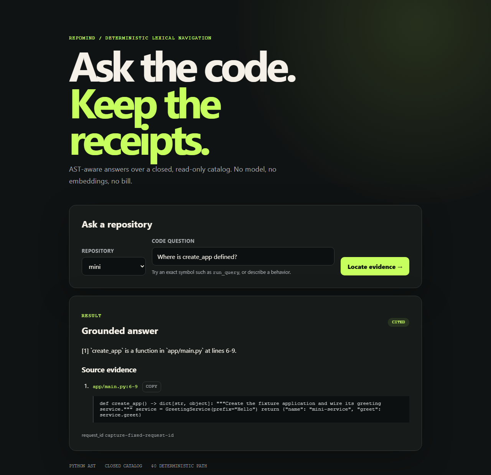
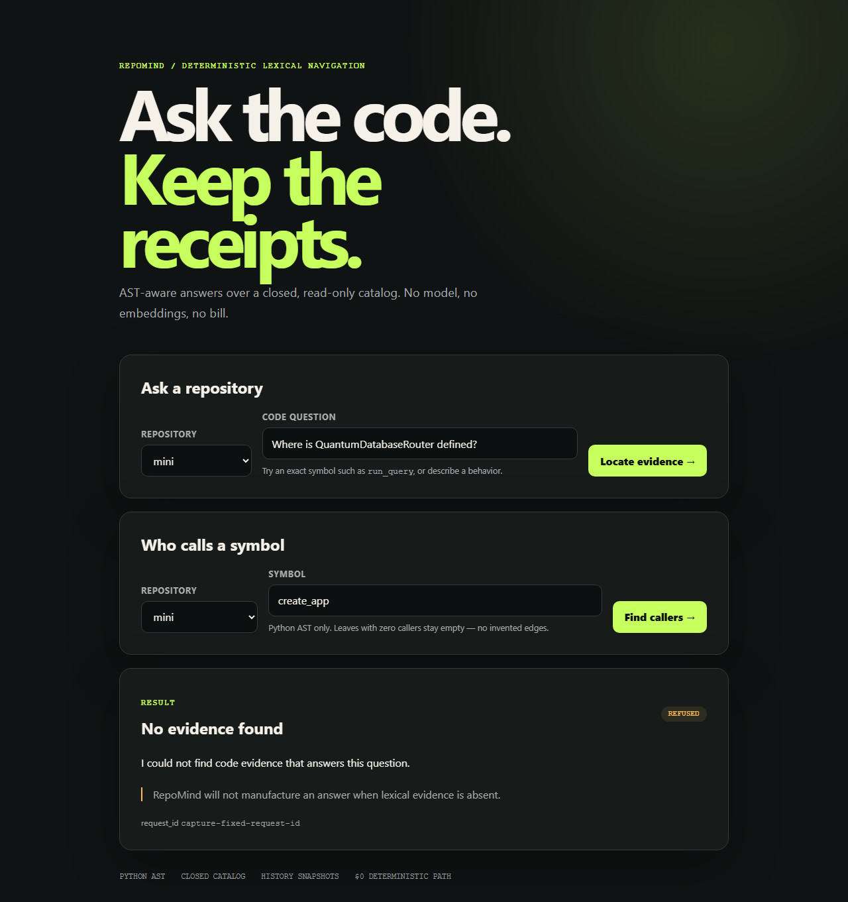
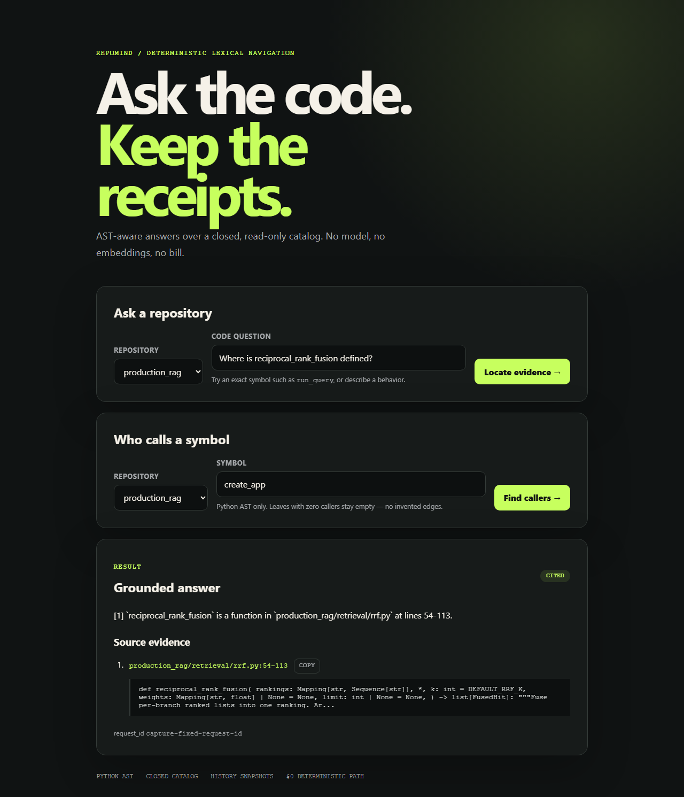

# RepoMind

<p align="center">
  <a href="https://github.com/pabloalvarez99/production-rag"></a>
  <a href="https://github.com/pabloalvarez99/agentic-rag-research"></a>
  <a href="https://github.com/pabloalvarez99/multi-agent-orchestration"></a>
  <a href="https://github.com/pabloalvarez99/repomind"></a>
  <a href="https://github.com/pabloalvarez99/ai-platform"></a>
</p>

[](https://github.com/pabloalvarez99/repomind/actions/workflows/ci.yml)
[](https://www.python.org/downloads/)
[](LICENSE)

Repository Q&A with AST-aware Python chunking and path:line citations, designed to run
end to end without API keys, network calls, or billed providers.

> Production-shaped AI systems: free-path demos, real architecture, measurable behavior,
> honest scope.

**Hiring managers start here: [case study](docs/CASESTUDY.md)** — four decisions, the
trade-off each one bought, and exactly what the 14/14 and 8/8 eval scores do and do not
prove. Two minutes, no setup. The console is also
[hosted](https://pax-repomind.vercel.app) if you would rather click than clone, and
screenshots are [below](#evidence-you-can-see-without-running-anything).

## Status

| Milestone | Capability | Status |
| --- | --- | --- |
| M0 | Python package, FastAPI health endpoint, tests and CI | LIVE |
| M1 | Repository walk and AST chunks | LIVE |
| M2 | In-memory symbol and token index | LIVE |
| M3 | Code Q&A with path:line citations | LIVE |
| M4 | JSON CLI | LIVE |
| M5 | Fixture evaluation harness | LIVE |
| M6 | Production RAG snapshot, closed catalog and symbol outline | LIVE |
| M7 | Local ask console, release docs and container | LIVE |
| M8 | Hosted free-path ask console | LIVE |

## Hosted demo

**<https://pax-repomind.vercel.app>** — the same free path, no clone and no key.

```bash
curl -s https://pax-repomind.vercel.app/health
curl -s https://pax-repomind.vercel.app/v1/code/ask \
  -H 'content-type: application/json' \
  -d '{"question":"Where is create_app defined?","repo_id":"mini"}'
```

The hosted instance answers over the same committed fixtures as the local path: the `mini`
regression repository and the frozen `production_rag` snapshot. It indexes those fixtures
and nothing else, so it cannot answer about an arbitrary repository. Lexical retrieval over
a small fixture — evidence that the citation path works end to end, not a state-of-the-art
code-RAG result.

## Evidence you can see without running anything

Every image below is regenerated by `python scripts/capture_ui.py`, which starts the packaged
app, drives the real `GET /ask` console, and refuses to write a screenshot whose rendered
outcome disagrees with its caption. The correlation id is frozen to `capture-fixed-request-id`
so reruns are byte-identical; nothing else is edited.



*Committed `mini` fixture. Exact-symbol hit citing `app/main.py:6-9`, with the repository
selector and request id visible. Lexical navigation over a tiny fixture — not a benchmark
result.*



*Committed `mini` fixture. Unknown symbol produces the fixed refusal and an empty citation
list — the failure mode is explicit, not a guessed answer.*



*Frozen `production_rag` snapshot committed under `fixtures/`. Citation resolves to
`production_rag/retrieval/rrf.py:54-113`. A small vendored snapshot, not a live sibling
checkout and not a code-RAG state-of-the-art claim.*

Read the [case study](docs/CASESTUDY.md) for the four decisions behind these screenshots and
for what the eval scores do and do not prove.

## Try the free path

Requires Python 3.12+.

```bash
python -m venv .venv
# Windows: .venv\Scripts\python -m pip install -e ".[dev]"
.venv/bin/python -m pip install -e ".[dev]"
.venv/bin/python -m pytest -q
.venv/bin/python -m uvicorn repomind.main:app --port 8020
curl -s http://127.0.0.1:8020/health
curl -s http://127.0.0.1:8020/v1/code/ask \
  -H 'content-type: application/json' \
  -d '{"question":"Where is create_app defined?","repo_id":"mini"}'
```

Open `http://127.0.0.1:8020/` for the ask console. It shows grounded answers or explicit
refusals, citations as `path:start-end`, and the request correlation id. It uses no CDN.

The default path is deterministic and offline. `.env.example` contains only empty
placeholders; RepoMind does not read them.

Ask from the command line; stdout is exactly one JSON object:

```bash
python -m repomind ask "Where is create_app defined?" --fixture mini
python -m repomind ask "Where is run_query defined?" --repo production_rag
python -m repomind.evals.run
python -m repomind.evals.dogfood
```

## Architecture

```text
repository → safe walk → Python AST chunks → in-memory index
question   → symbol/token retrieval → grounded answer or refusal
                                      └─ path:start_line-end_line citations
```

The committed 14-question mini gate and 8-question Production RAG dogfood gate run offline.
They prove control flow, citation correctness, and refusal behavior on committed bytes—not
retrieval quality on arbitrary repositories. The dogfood suite is a navigation/citation gate
over a small frozen snapshot, not a general code-RAG benchmark. See the
[evaluation contract](data/eval/README.md).

M1 uses hierarchical gitwildmatch rules from every nested `.gitignore`, skips symlinks, and emits
one chunk per Python class, function, async function, and method. A chunk id is
`path::qualname`; its line range comes directly from Python's AST.

M2 indexes those chunks in memory. Exact symbol matches outrank identifier-aware token
overlap across qualified names, paths, and source; deterministic tie-breaking makes results
reproducible. There is no embedding model and no network call in this index.

M3 exposes `POST /v1/code/ask`. Every answer sentence identifies a retrieved definition and
every citation carries its repository-relative path and exact AST line range. No match produces
an explicit refusal with an empty citation list. Repository ids select a fixed catalog; they are
never interpreted as caller-controlled filesystem paths.

M6 adds `GET /v1/code/symbols?repo_id=mini`, which returns a stable AST outline, and a second
catalog id, `production_rag`. That id resolves to a curated snapshot committed here. Local
operators may point the existing id at another read-only root with
`REPOMIND_CATALOG_PRODUCTION_RAG`; evals deliberately ignore the override.

M4 and M5 put the same service behind a JSON CLI and a committed 14-question fixture gate.
The gate covers exact symbols, prose retrieval, line citations, refusals, and definitions in
gitignored files. It is a regression check for this fixture—not a claim about arbitrary-repo
answer quality—and reports `judge: null` and `billed_usd: 0.0`.

## API surface

- `GET /health` — liveness and version.
- `GET /v1/catalog` — every repository served, with its tree hash and indexer version.
- `GET /v1/code/symbols?repo_id=mini` — deterministic definition outline.
- `POST /v1/code/ask` — answer or fixed refusal with path:line citations.
- `GET /` and `GET /ask` — accessible ask console, local or hosted.

### `repo_id` is a catalog identifier

Every surface above resolves `repo_id` through one function, `repomind.catalog.validate_repo_id`,
whose allowlist is derived from `catalog_roots()`. The valid ids are exactly `mini` and
`production_rag` — an id is an identifier the catalog hands out, not a URL slug, so an underscore
in it means nothing and is forbidden by nothing. A blank id is `422`, a path-shaped id such as
`../../etc` is `400`, and a well-formed id outside the catalog is `404`. The CLI applies the same
rule, exits `2`, and prints the known ids.

### The index is content-addressed

Every definition carries a `content_hash` over its kind, qualified name, and exact source text.
Every visible file carries a blob hash, and every repository a `tree_hash` folded from the
sorted `(path, blob_hash)` pairs plus the `INDEXER_VERSION` that read them. `GET /v1/catalog`
publishes those, so two instances reporting the same tree hash and indexer version are provably
answering from the same index.

Ingest is incremental against those addresses: re-ingesting an unchanged repository parses zero
files, and an edit costs one parse instead of a repository. Python sources are hashed after
CRLF normalization, so one commit checked out on Windows and on Linux advertises one index.

There is no upload endpoint, and there will not be one. The hosted instance indexes only the
fixtures committed here — see [ADR 0003](docs/adr/0003-content-addressed-catalog-index.md) for
why a public box that ingests a stranger's archive is a different product with different risks.

The hosted deployment serves this same ASGI app: `main.py` at the repository root imports
`repomind.main:app`, and `vercel.json` builds it with `@vercel/python`, including `src/`
and `fixtures/` so the packaged catalog resolves in the function.

See [architecture](docs/architecture.md), [case study](docs/CASESTUDY.md), and the
[ship checklist](docs/SHIP.md). Security reports and local contributions are covered by
[SECURITY.md](SECURITY.md) and [CONTRIBUTING.md](CONTRIBUTING.md).

## License

MIT — see [LICENSE](LICENSE).
